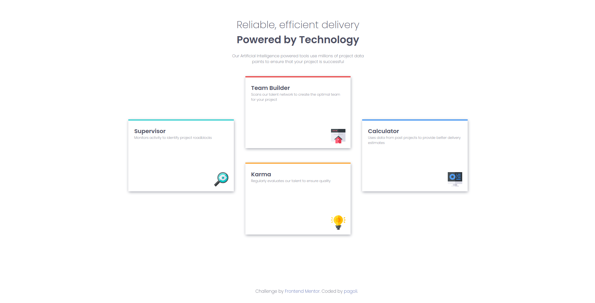
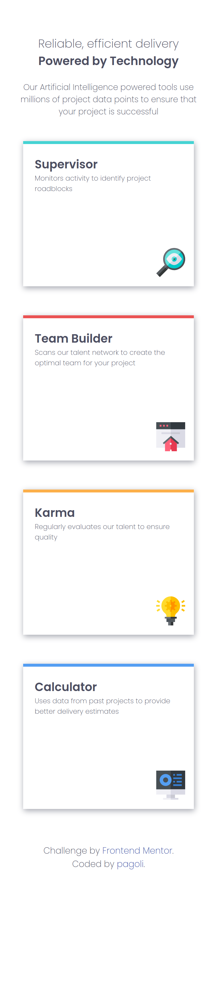

# four-card-feature-section

## Table of contents

- [Overview](#overview)
  - [The challenge](#the-challenge)
  - [Screenshot](#screenshot)
  - [Links](#links)
- [My process](#my-process)
  - [Built with](#built-with)
  - [What I learned](#what-i-learned)

## Overview

### The Challenge

- View the optimal layout for the site depending on their device's screen size

### Screenshots

View the 
and the .

### Links

- Solution URL: [click here](https://github.com/pagoli/four-card-feature-section)
- Live Site URL: [click here](https://pagoli.github.io/four-card-feature-section/)

## My process

### Built with

- HTML
- CSS custom properties
- Flexbox

### What I learned

Repeated Flexbox